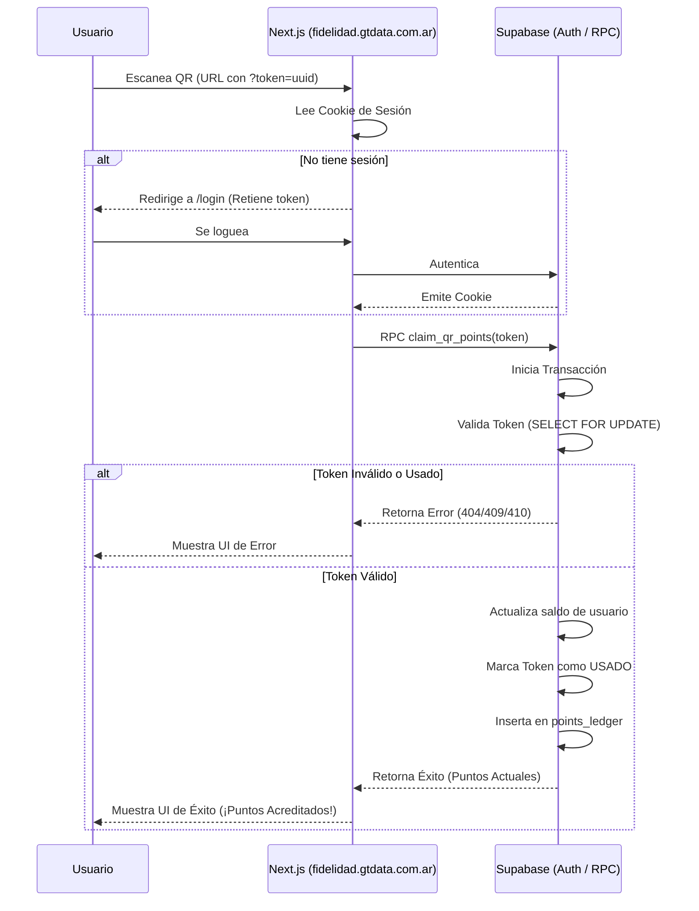

# Arquitectura del Sistema de Fidelización

Este documento describe la arquitectura, flujo de datos y componentes del sistema de fidelización de **Alfajores Mandrola**.

## Componentes Principales

1. **Frontend (Vercel)**
   - **Framework:** Next.js (App Router).
   - **Estilos:** Tailwind CSS.
   - **Dominio:** `fidelidad.gtdata.com.ar` (Subdominio en DonWeb apuntando vía CNAME a Vercel).
   - **Funcionalidad:** Escaneo/Recepción de QR, Autenticación (Magic Link / OAuth), Feedback en tiempo real al usuario (Puntos ganados).

2. **Backend / Base de Datos (Supabase)**
   - **Base de Datos:** PostgreSQL.
   - **Autenticación:** Supabase Auth gestionando sesiones a través de cookies (SSR compatible).
   - **Lógica Transaccional:** Función RPC (Remote Procedure Call) segura en PostgreSQL que maneja la validación de tokens y actualización de saldo de manera atómica (evita vulnerabilidades de concurrencia).

## Flujo de Escaneo de QR

## Prevención de Colisiones de Dominio

Al utilizar `fidelidad.gtdata.com.ar`:
- Las **cookies** de Supabase Auth se emitirán con alcance para este subdominio (`domain: 'fidelidad.gtdata.com.ar'`).
- El CORS en las rutas API de Next.js restringirá operaciones cruzadas no autorizadas desde otros orígenes.
- La variable de entorno `NEXT_PUBLIC_SITE_URL` será explícitamente configurada a `https://fidelidad.gtdata.com.ar` para el correcto flujo de redirección post-login.
